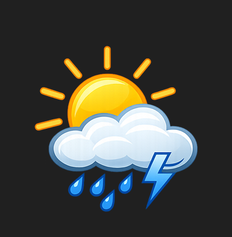

# Weather App 🌤️

## Project Overview
This project demonstrates object-oriented programming (OOP) in Python combined with API integration.  
We use the OpenWeather API to fetch real-time weather data and display it in a simple console application.

## Visual Representation

## Example Output
Enter city name: Belgrade
Belgrade: 18°C, clear sky

## Technologies Used
- Python 3.14
- Requests library
- OpenWeather API

## Scripts
- `weather_service.py` → Handles API requests.  
- `weather_data.py` → Defines the WeatherData class.  
- `app.py` → Main application logic.  

## Setup
1. Register at [OpenWeather](https://openweathermap.org/api) and get your API key.  
2. Replace `"YOUR_API_KEY_HERE"` in `app.py` with your key.  
3. Run the app:  
python app.py

